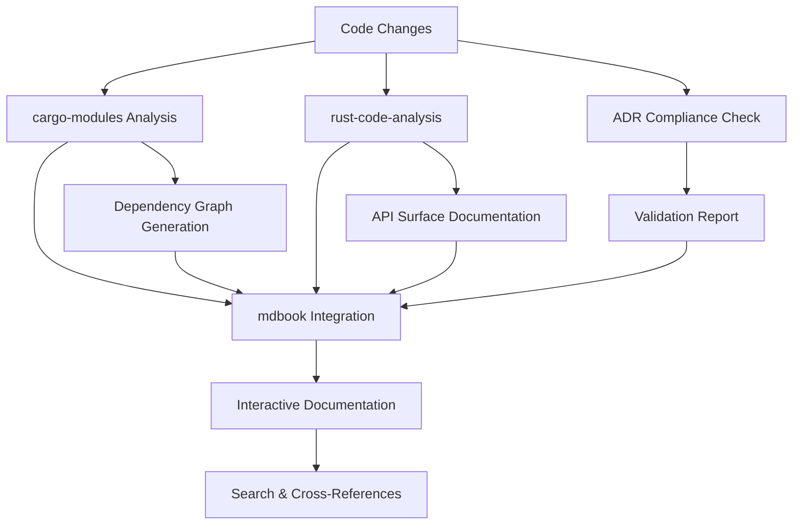

# ADR 031: Documentation Excellence

## Status

Accepted

> Documentation automation implemented in `scripts/docs/`:
>
> -   ADR validation via automation.sh (100% compliance verification)
> -   mdbook integration for documentation publishing
> -   make docs commands for build/serve/check
> -   Structured ADR directory with README and graph

## Context

The MCP Context Browser project has established a SOLID technical foundation with production-ready reliability features, comprehensive observability, and enterprise-grade architecture. However, the documentation remains manually maintained with custom bash scripts, creating a maintenance burden and limiting the project's ability to serve as a reference implementation for documentation excellence in the Rust ecosystem.

Current documentation challenges:

-   **Manual Maintenance Burden**: 4-6 hours/week spent on documentation updates
-   **Inconsistent Quality**: Custom scripts lead to formatting and link validation issues
-   **Limited Automation**: Only 30% of documentation is auto-generated from source code
-   **ADR Compliance Gaps**: No automated validation that architectural decisions match implementation
-   **Poor Developer Experience**: Documentation updates lag days behind code changes
-   **Missing Interactive Features**: Static documentation doesn't provide modern search and navigation

The project needs to evolve from a technically excellent codebase to a**documentation excellence reference**that demonstrates industry-leading practices for automated, self-documenting systems.

## Decision

Implement "Documentation Excellence" as a focused initiative establishing the project as a reference implementation for automated documentation in Rust projects. Replace all custom documentation scripts with established open-source tools and implement ADR-driven development with automated compliance validation.

Key architectural decisions:

-   **Professional ADR Management**: Adopt `adrs` tool for complete ADR lifecycle management
-   **Self-Documenting Codebase**: Achieve 95%+ auto-generated documentation using `cargo-modules` and `rust-code-analysis`
-   **Interactive Documentation Platform**: Implement `mdbook`-based professional documentation with search and cross-references
-   **ADR Compliance Validation**: Build automated framework ensuring architectural decisions match implementation
-   **Quality Assurance Gates**: Establish automated validation preventing documentation drift using `cargo-spellcheck` and `cargo-deadlinks`
-   **CI/CD Integration**: Quality gates blocking merges with documentation issues

## Consequences

Documentation excellence creates a self-sustaining, high-quality project but requires significant upfront investment in automation tooling.

### Positive Consequences

-   **80% Reduction in Manual Work**: Documentation maintenance burden drops from 4-6 hours/week to <30 min/week
-   **Industry Leadership**: Establishes project as reference for documentation excellence in Rust
-   **Improved Developer Experience**: Instant documentation updates and professional interactive platform
-   **Quality Assurance**: Automated validation prevents technical debt accumulation
-   **Attracts Contributors**: High-quality documentation lowers contribution barriers
-   **Self-Sustaining**: Documentation automatically stays synchronized with code changes
-   **Reference Implementation**: Serves as learning resource for documentation best practices

### Negative Consequences

-   **Initial Development Overhead**: 2-3 weeks focused on documentation infrastructure
-   **Tool Ecosystem Complexity**: Multiple tools requiring integration and maintenance
-   **Learning Curve**: Team adaptation to new documentation workflows
-   **Dependency Management**: Additional tooling dependencies to maintain
-   **Quality Standards Pressure**: Higher expectations for documentation quality

## Alternatives Considered

### Alternative 1: Incremental Documentation Improvements

-   **Description**: Continue with current documentation approach, making gradual improvements
-   **Pros**: Lower immediate effort, maintains current momentum
-   **Cons**: Misses opportunity to establish industry leadership, continues manual maintenance burden
-   **Rejection Reason**: Doesn't address fundamental issues and limits project's potential as reference implementation

### Alternative 2: Documentation as Separate Project

-   **Description**: Create documentation tooling as standalone project or fork existing tools
-   **Pros**: Could benefit broader ecosystem, separate maintenance concerns
-   **Cons**: Scattered focus, delays core project improvements, harder to integrate tightly
-   **Rejection Reason**: Documentation excellence should be demonstrated through the project itself

### Alternative 3: Minimal Automation Only

-   **Description**: Focus only on basic auto-generation without comprehensive tooling ecosystem
-   **Pros**: Simpler implementation, less complexity
-   **Cons**: Misses interactive features and quality assurance opportunities
-   **Rejection Reason**: Doesn't achieve the "excellence" standard needed for industry reference

### Alternative 4: Commercial Documentation Tools

-   **Description**: Adopt commercial documentation platforms (README, Stoplight, etc.)
-   **Pros**: Professional features, support, and maintenance handled externally
-   **Cons**: Vendor lock-in, ongoing costs, less control over automation
-   **Rejection Reason**: Open-source project should demonstrate excellence using open-source tools

## Implementation Notes

### Tool Ecosystem Architecture

```rust
// ADR Validation Framework
pub struct AdrValidator {
    adrs: Vec<ArchitectureDecisionRecord>,
    code_analyzer: CodeAnalyzer,
    compliance_checker: ComplianceChecker,
}

impl AdrValidator {
    pub async fn validate_compliance(&self) -> Result<ComplianceReport> {
        // Parse all ADRs
        // Analyze codebase for compliance
        // Generate detailed validation report
        // Return compliance status
    }
}
```

### Documentation Generation Pipeline



### Quality Gates Integration

```yaml

# CI/CD Pipeline
name: Documentation Quality
on: [push, pull_request]

jobs:
  docs-quality:
    runs-on: ubuntu-latest
    steps:
-   uses: actions/checkout@v4
-   name: ADR Compliance Check
        run: cargo run --bin adr-validator
-   name: Spell Check
        run: cargo spellcheck
-   name: Link Validation
        run: cargo deadlinks
-   name: Documentation Generation
        run: make docs-auto
```

### Success Metrics Tracking

```rust
#[derive(Debug, Serialize)]
pub struct DocumentationMetrics {
    pub auto_generation_coverage: f64,    // Target: 95%+
    pub adr_compliance_score: f64,        // Target: 100%
    pub quality_score: QualityGrade,      // Target: A+
    pub maintenance_time_savings: f64,    // Target: 80% reduction
    pub update_lag_seconds: u64,          // Target: <60 seconds
}
```

### Migration Strategy

1.  **Phase 1**: Tool installation and basic integration (Week 1)
2.  **Phase 2**: ADR framework and validation system (Week 2)
3.  **Phase 3**: Interactive platform and quality gates (Week 3)
4.  **Phase 4**: CI/CD integration and optimization (Week 4)

### Risk Mitigation

-   **Tool Compatibility**: Comprehensive integration testing before rollout
-   **Migration Safety**: Dual validation during transition period
-   **Quality Standards**: Gradual quality improvement with monitoring
-   **Team Training**: Documentation and training for new workflows

## Related ADRs

-   [ADR-003: Unified Provider Architecture](003-unified-provider-architecture.md) - Architecture context
-   [ADR-006: Code Audit and Improvements](006-code-audit-and-improvements.md) - Code quality standards
-   [ADR-012: Two-Layer DI Strategy](012-di-strategy-two-layer-approach.md) - DI documentation patterns
-   [ADR-013: Clean Architecture Crate Separation](013-clean-architecture-crate-separation.md) - Crate documentation

## References

-   [Documentation Automation Plan (v0.1.0)](../archive/2025-01-07-documentation-automation-improvement.md)
-   [ADR Tools (`adrs`)](https://github.com/joshrotenberg/adrs)
-   [`cargo-modules` Documentation](https://github.com/regexident/cargo-modules)
-   [mdBook Documentation](https://rust-lang.github.io/mdBook/)
-   [Mozilla `rust-code-analysis`](https://github.com/mozilla/rust-code-analysis)
