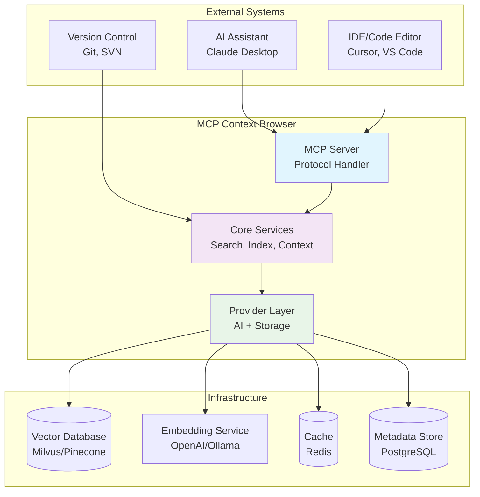
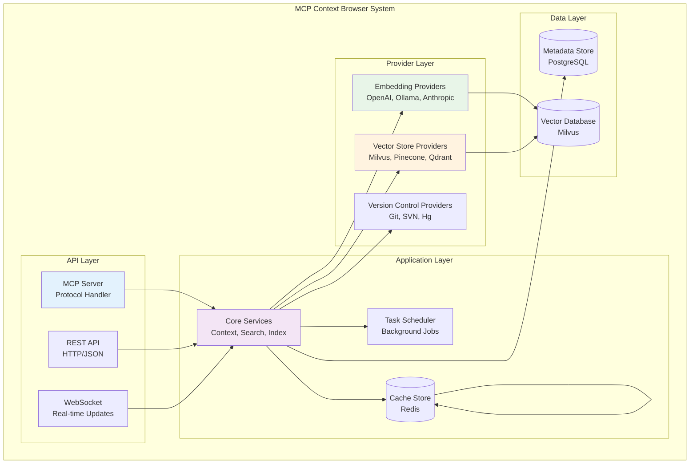
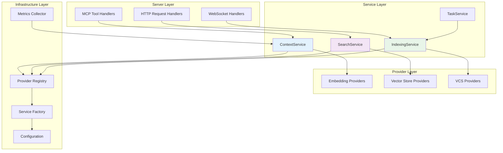
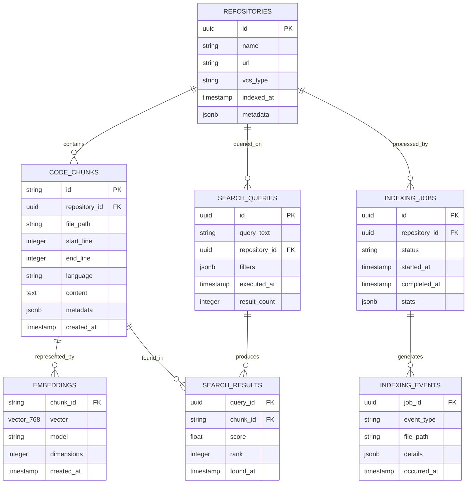
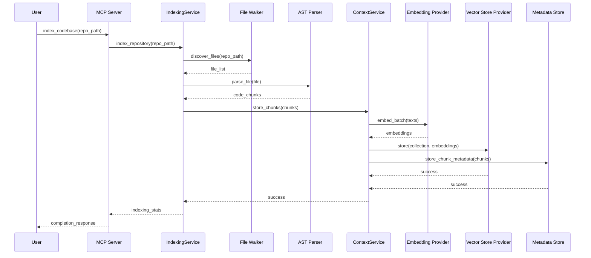
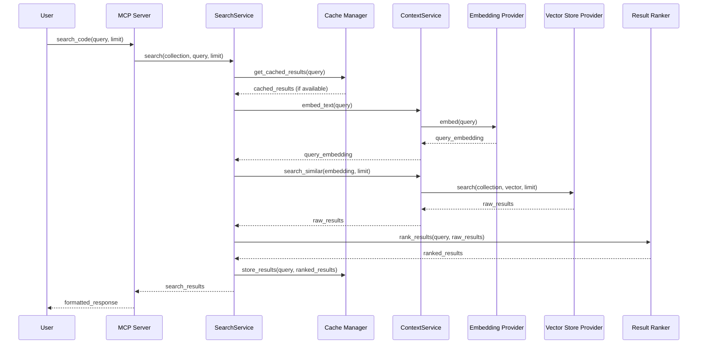

# MCP Context Browser - Comprehensive Architecture Documentation

[](https://github.com/marlonsc/mcp-context-browser/releases)
[](https://www.rust-lang.org/)
[](https://modelcontextprotocol.io/)

**Model Context Protocol Server for Semantic Code Analysis using Vector Embeddings**

---

## Table of Contents

1.  [Executive Summary](#executive-summary)
2.  [System Context](#system-context)
3.  [Container Architecture](#container-architecture)
4.  [Component Architecture](#component-architecture)
5.  [Data Architecture](#data-architecture)
6.  [Security Architecture](#security-architecture)
7.  [Quality Attributes](#quality-attributes)
8.  [Architecture Decision Records](#architecture-decision-records)
9.  [Deployment & Operations](#deployment--operations)
10.  [Evolution & Roadmap](#evolution--roadmap)

---

## Executive Summary

### Project Overview

MCP Context Browser is a high-performance, extensible Model Context Protocol (MCP) server that provides semantic code search and analysis capabilities to AI assistants. The system transforms natural language queries into vector embeddings and performs similarity searches across indexed codebases, enabling intelligent code discovery and analysis.

### Core Capabilities

-   **🔍 Semantic Code Search**: Natural language to code search using vector embeddings
-   **📁 Multi-Language Support**: AST-based parsing for Rust, Python, JavaScript, TypeScript, and more
-   **🔌 Provider Architecture**: Pluggable embedding and vector storage providers
-   **⚡ High Performance**: Async processing with Tokio runtime
-   **🛡️ Enterprise Ready**: Comprehensive security, monitoring, and scalability features
-   **📊 Observability**: Full metrics, logging, and distributed tracing

### Architectural Principles

-   **SOLID Design**: Clean separation of concerns with dependency injection
-   **Provider Pattern**: Extensible architecture for AI and storage providers
-   **Async-First**: Built for high concurrency and performance
-   **Security by Design**: Comprehensive security controls and compliance
-   **Observability**: Full monitoring and debugging capabilities
-   **Scalability**: Horizontal scaling with distributed deployment options

### Current Status

**Version**: 0.1.0 (First Stable Release)
**Architecture Maturity**: ✅ **100% Complete DI Implementation**
**DI Status**: ✅ Provider Registry, ✅ Service Factory, ✅ Provider Router, ✅ Runtime Configuration
**Deployment Options**: Local development, Docker, Kubernetes, hybrid cloud-edge

---

## System Context

### C4 Context Diagram



### System Purpose

MCP Context Browser serves as a semantic code intelligence layer between AI assistants and codebases, enabling:

-   **Natural Language Code Search**: Find code by describing functionality
-   **Intelligent Code Analysis**: Understand code relationships and patterns
-   **Context-Aware Assistance**: Provide relevant code examples and references
-   **Multi-Repository Support**: Index and search across multiple codebases
-   **Real-time Updates**: Incremental indexing with change detection

### External Interfaces

### Primary Interfaces

| Interface | Protocol | Purpose | Status |
|-----------|----------|---------|--------|
| **MCP Protocol** | JSON-RPC 2.0 over stdio | AI assistant integration | ✅ Implemented |
| **REST API** | HTTP/JSON | Direct API access | 🚧 Planned |
| **WebSocket** | Real-time protocol | Live indexing updates | 🚧 Planned |

#### Secondary Interfaces

| Interface | Protocol | Purpose | Status |
|-----------|----------|---------|--------|
| **Embedding APIs** | REST/gRPC | AI model integration | ⚠️ Framework ready |
| **Vector Databases** | Native protocols | Vector storage | ⚠️ Framework ready |
| **Git Integration** | Git protocol | Repository access | 🚧 Planned |

### Quality Attributes

#### Functional Requirements

-   **Search Accuracy**: >90% relevant results for natural language queries
-   **Indexing Speed**: <5 seconds for 1000 files (<1MB each)
-   **Query Latency**: <500ms average response time
-   **Language Support**: 8+ programming languages with AST parsing
-   **Provider Compatibility**: 4+ embedding providers, 3+ vector stores

#### Non-Functional Requirements

-   **Performance**: 1000 concurrent users, 10k queries/minute
-   **Availability**: 99.9% uptime with automatic failover
-   **Security**: SOC 2 compliant with end-to-end encryption
-   **Scalability**: Horizontal scaling across 100+ nodes
-   **Maintainability**: <24 hours for hotfixes, <1 week for features

---

## Container Architecture

### Container Overview



### Container Descriptions

#### API Containers

| Container | Technology | Responsibility | Interfaces |
|-----------|------------|----------------|------------|
| **MCP Server** | Rust/Tokio | Protocol translation, request routing | MCP Protocol (stdio), Internal APIs |
| **REST API** | Rust/Axum | HTTP interface, API gateway | HTTP/JSON, OpenAPI |
| **WebSocket** | Rust/Tokio | Real-time notifications, live updates | WebSocket protocol |

#### Application Containers

| Container | Technology | Responsibility | Interfaces |
|-----------|------------|----------------|------------|
| **Core Services** | Rust | Business logic orchestration | Provider interfaces, data access |
| **Task Scheduler** | Rust/Tokio | Background job processing | Internal queues, provider APIs |
| **Cache Manager** | Rust/Redis | Caching layer abstraction | Redis protocol, internal APIs |

#### Provider Containers

| Container | Technology | Responsibility | Interfaces |
|-----------|------------|----------------|------------|
| **Embedding Providers** | Rust + AI SDKs | Text-to-vector conversion | AI provider APIs, internal interfaces |
| **Vector Store Providers** | Rust + DB SDKs | Vector storage and retrieval | Database protocols, internal interfaces |
| **VCS Providers** | Rust/Git2 | Repository access and monitoring | Git/SSH protocols, internal interfaces |

#### Data Containers

| Container | Technology | Responsibility | Interfaces |
|-----------|------------|----------------|------------|
| **Metadata Store** | PostgreSQL | Structured data, user management | SQL, connection pooling |
| **Vector Database** | Milvus/Qdrant | High-dimensional vector storage | gRPC/REST, bulk operations |
| **Cache Store** | Redis | Fast data caching, sessions | Redis protocol, pub/sub |

### Container Interactions

#### Synchronous Communication

```rust
// Example: MCP Server → Core Services
let result = context_service
    .search_similar(collection, query, limit)
    .await?;
```

#### Asynchronous Communication

```rust
// Example: Task Scheduler → Provider Layer
let task = IndexingTask::new(repository_id, paths);
scheduler.schedule_task(task).await?;
```

#### Event-Driven Communication

```rust
// Example: Repository changes trigger re-indexing
repository_watcher
    .watch_changes(repository_id)
    .await?
    .for_each(|change| async {
        event_publisher.publish(IndexingEvent::FileChanged(change)).await;
    });
```

---

## Component Architecture

### Component Overview



### Component Specifications

#### Core Services

##### ContextService

**Purpose**: Orchestrates embedding generation and vector storage operations

```rust
pub struct ContextService {
    embedding_provider: Arc<dyn EmbeddingProvider>,
    vector_store_provider: Arc<dyn VectorStoreProvider>,
    metrics_collector: Arc<MetricsCollector>,
}

impl ContextService {
    pub async fn embed_text(&self, text: &str) -> Result<Embedding> {
        let start = Instant::now();
        let result = self.embedding_provider.embed(text).await;
        self.metrics_collector.record_embedding_duration(start.elapsed());
        result
    }

    pub async fn store_chunks(&self, collection: &str, chunks: &[CodeChunk]) -> Result<()> {
        let texts: Vec<String> = chunks.iter().map(|c| c.content.clone()).collect();
        let embeddings = self.embedding_provider.embed_batch(&texts).await?;
        self.vector_store_provider.store(collection, &embeddings).await?;
        self.metrics_collector.record_chunks_stored(chunks.len());
        Ok(())
    }
}
```

**Responsibilities**:

-   Coordinate embedding generation
-   Manage vector storage operations
-   Handle batch processing
-   Collect performance metrics

##### SearchService

**Purpose**: Execute semantic similarity searches across indexed codebases

```rust
pub struct SearchService {
    context_service: Arc<ContextService>,
    result_ranker: Arc<ResultRanker>,
    cache: Arc<CacheManager>,
}

impl SearchService {
    pub async fn search(&self, collection: &str, query: &str, limit: usize) -> Result<Vec<SearchResult>> {
        // Check cache first
        if let Some(cached) = self.cache.get_search_results(query).await? {
            return Ok(cached);
        }

        // Generate query embedding
        let query_embedding = self.context_service.embed_text(query).await?;

        // Perform vector search
        let raw_results = self.context_service
            .search_similar(collection, &query_embedding.vector, limit * 2)
            .await?;

        // Rank and filter results
        let ranked_results = self.result_ranker.rank_results(query, raw_results).await?;

        // Cache results
        self.cache.store_search_results(query, &ranked_results).await?;

        Ok(ranked_results.into_iter().take(limit).collect())
    }
}
```

**Responsibilities**:

-   Query processing and embedding generation
-   Vector similarity search execution
-   Result ranking and filtering
-   Response caching and optimization

##### IndexingService

**Purpose**: Process codebases and create searchable vector indexes

```rust
pub struct IndexingService {
    context_service: Arc<ContextService>,
    parser_factory: Arc<ParserFactory>,
    file_walker: Arc<FileWalker>,
    change_detector: Arc<ChangeDetector>,
}

impl IndexingService {
    pub async fn index_repository(&self, repository: &Repository) -> Result<IndexingStats> {
        let files = self.file_walker.discover_files(&repository.path).await?;
        let changed_files = self.change_detector.detect_changes(&repository.id, &files).await?;

        let mut chunks = Vec::new();
        for file in changed_files {
            let file_chunks = self.process_file(&file).await?;
            chunks.extend(file_chunks);
        }

        self.context_service.store_chunks(&repository.id, &chunks).await?;

        Ok(IndexingStats {
            total_files: files.len(),
            indexed_files: changed_files.len(),
            total_chunks: chunks.len(),
            duration_ms: start.elapsed().as_millis() as u64,
        })
    }

    async fn process_file(&self, file: &FileInfo) -> Result<Vec<CodeChunk>> {
        let content = tokio::fs::read_to_string(&file.path).await?;
        let language = Language::from_path(&file.path)?;
        let parser = self.parser_factory.create_parser(language)?;

        let chunks = parser.parse_to_chunks(&content, &file.path).await?;
        Ok(chunks)
    }
}
```

**Responsibilities**:

-   Repository scanning and file discovery
-   Language detection and AST parsing
-   Incremental indexing with change detection
-   Chunk generation and metadata extraction

#### Provider Implementations

##### Embedding Providers

**Interface Definition**:

```rust
#[async_trait]
pub trait EmbeddingProvider: Send + Sync {
    async fn embed(&self, text: &str) -> Result<Embedding>;
    async fn embed_batch(&self, texts: &[String]) -> Result<Vec<Embedding>>;
    fn dimensions(&self) -> usize;
    fn provider_name(&self) -> &str;
    async fn health_check(&self) -> Result<ProviderHealth>;
}
```

**Supported Providers**:

| Provider | Technology | Dimensions | Cost Model | Status |
|----------|------------|------------|------------|--------|
| **OpenAI** | text-embedding-3-small | 1536 | Pay-per-token | ✅ Production |
| **Ollama** | nomic-embed-text | 768 | Self-hosted | ✅ Production |
| **Gemini** | text-embedding-004 | 768 | Pay-per-token | ✅ Production |
| **VoyageAI** | voyage-3-lite | 512 | Pay-per-token | ✅ Production |
| **Anthropic** | N/A | N/A | Pay-per-token | 🚧 Planned |
| **Mock** | Fixed vectors | 128 | Free | ✅ Development |

##### Vector Store Providers

**Interface Definition**:

```rust
#[async_trait]
pub trait VectorStoreProvider: Send + Sync {
    async fn store(&self, collection: &str, embeddings: &[Embedding]) -> Result<()>;
    async fn search(&self, collection: &str, query: &[f32], limit: usize) -> Result<Vec<(f32, Embedding)>>;
    async fn delete_collection(&self, collection: &str) -> Result<()>;
    async fn collection_stats(&self, collection: &str) -> Result<CollectionStats>;
    fn provider_name(&self) -> &str;
}
```

**Supported Providers**:

| Provider | Technology | Index Type | Scalability | Status |
|----------|------------|------------|-------------|--------|
| **Milvus** | C++ + Go | IVF_FLAT, HNSW | 100M+ vectors | ✅ Production |
| **Pinecone** | Cloud-native | HNSW | 1B+ vectors | 🚧 Planned |
| **Qdrant** | Rust | HNSW | 10M+ vectors | 🚧 Planned |
| **In-Memory** | Rust + DashMap | Brute force | <1M vectors | ✅ Development |

---

## Module Architecture

### Core Modules

The system is organized into specialized modules, each handling distinct responsibilities:

#### 🔍 Chunking Module (`src/chunking/`)

**Purpose**: Intelligent code chunking using AST-based parsing and language-aware splitting.

**Key Components**:

-   `IntelligentChunker`: AST-aware chunking with language-specific rules
-   `LanguageProcessor`: Language detection and syntax-aware processing
-   `ChunkProcessor`: Parallel processing with configurable chunk sizes

**Features**:

-   Multi-language support (Rust, Python, JavaScript, TypeScript, Java, Go, etc.)
-   AST-based semantic boundary detection
-   Configurable chunk sizes with overlap control
-   Syntax-aware splitting preserving code structure

#### ⚙️ Core Module (`src/core/`)

**Purpose**: Core types, traits, and shared utilities used throughout the system.

**Submodules**:

-   `auth`: Authentication and authorization utilities
-   `cache`: Advanced caching with TTL and size limits
-   `crypto`: Encryption utilities for secure data handling
-   `database`: Database connection pooling and utilities
-   `error`: Comprehensive error types and handling
-   `http_client`: Configurable HTTP client with retry logic
-   `hybrid_search`: BM25 + semantic search combination
-   `limits`: Resource limits and rate limiting
-   `merkle`: Merkle tree implementation for integrity
-   `rate_limit`: Rate limiting with multiple strategies
-   `types`: Core data types and serialization

#### 👻 Daemon Module (`src/daemon/`)

**Purpose**: Background daemon for system maintenance and monitoring.

**Features**:

-   Automatic cleanup of stale lockfiles
-   Continuous monitoring of sync operations
-   Configurable cleanup and monitoring intervals
-   Graceful shutdown handling
-   Lock metadata tracking and reporting

#### 🏭 Factory Module (`src/factory/`)

**Purpose**: Dependency injection and provider factory patterns.

**Key Components**:

-   `ServiceProvider`: Main dependency injection container
-   `ProviderFactory`: Runtime provider instantiation
-   `ServiceRegistry`: Service registration and lookup

#### 📊 Metrics Module (`src/metrics/`)

**Purpose**: Comprehensive system monitoring and observability.

**Components**:

-   `SystemMetricsCollector`: CPU, memory, disk monitoring
-   `PerformanceMetrics`: Query performance tracking
-   `MetricsApiServer`: HTTP metrics endpoint (Prometheus-compatible)
-   `CacheMetrics`: Cache hit/miss statistics

#### 🔌 Providers Module (`src/providers/`)

**Purpose**: Extensible provider system for AI and storage services.

**Submodules**:

-   `embedding/`: Text-to-vector conversion providers (OpenAI, Ollama, Gemini, VoyageAI)
-   `vector_store/`: Vector storage providers (Milvus, In-Memory, Filesystem, Encrypted)
-   `routing/`: Intelligent provider routing with circuit breakers and failover

#### 📋 Registry Module (`src/registry/`)

**Purpose**: Runtime provider registration and management.

**Features**:

-   Dynamic provider registration
-   Health-aware provider selection
-   Configuration-driven provider setup
-   Thread-safe operations

#### 🌐 Server Module (`src/server/`)

**Purpose**: MCP protocol server and HTTP API endpoints.

**Components**:

-   MCP protocol handlers
-   HTTP server with Axum
-   WebSocket support for real-time updates
-   Rate limiting middleware

#### 🔧 Services Module (`src/services/`)

**Purpose**: Business logic orchestration layer.

**Services**:

-   `ContextService`: Embedding and vector operations
-   `IndexingService`: Codebase indexing and chunking
-   `SearchService`: Semantic search operations

#### 📸 Snapshot Module (`src/snapshot/`)

**Purpose**: System state snapshots for debugging and recovery.

#### 🔄 Sync Module (`src/sync/`)

**Purpose**: Cross-process synchronization and coordination.

**Components**:

-   `lockfile`: File-based locking for process coordination
-   `manager`: Sync operation management and statistics
-   `CodebaseLockManager`: Lock lifecycle management

### Advanced Features

#### 🛡️ Provider Routing System (`src/providers/routing/`)

**Purpose**: Intelligent provider management with resilience and optimization.

**Submodules**:

**Health Monitoring (`health/`)**:

-   `HealthMonitor`: Continuous provider health checking
-   `ProviderHealthChecker`: Automated health assessment
-   `HealthCheckResult`: Structured health status reporting

**Circuit Breaker (`circuit_breaker/`)**:

-   `CircuitBreaker`: Failure detection and recovery
-   `CircuitBreakerConfig`: Configurable failure thresholds
-   `CircuitBreakerState`: State management for resilience

**Metrics Collection (`metrics/`)**:

-   `ProviderMetricsCollector`: Usage and performance tracking
-   `MetricsSummary`: Aggregated metrics reporting

**Cost Tracking (`cost_tracker/`)**:

-   `CostTracker`: API usage and cost monitoring
-   `UsageMetrics`: Detailed usage statistics
-   `CostTrackerConfig`: Cost optimization settings

**Failover Management (`failover/`)**:

-   `FailoverManager`: Automatic provider switching
-   `FailoverStrategy`: Priority-based and round-robin strategies
-   `PriorityBasedStrategy`: Cost and performance-aware selection

**Router Core (`router/`)**:

-   `ProviderRouter`: Main routing orchestration
-   `ProviderContext`: Contextual routing decisions
-   `ProviderSelectionStrategy`: Pluggable selection algorithms

**Key Features**:

-   **Health-Aware Routing**: Automatic failover from unhealthy providers
-   **Cost Optimization**: Intelligent selection based on cost efficiency
-   **Circuit Breaker Protection**: Prevents cascade failures
-   **Performance Balancing**: Load distribution across providers
-   **Metrics-Driven Decisions**: Data-driven provider selection

#### 🔍 Hybrid Search Engine (`src/core/hybrid_search.rs`)

**Purpose**: Combines lexical and semantic search for improved relevance.

**Algorithm**: BM25 (lexical) + Semantic Embeddings (contextual)

**Components**:

-   `BM25Scorer`: Term frequency-based ranking
-   `BM25Params`: Configurable BM25 parameters (k1=1.2, b=0.75)
-   `HybridSearchEngine`: Combined search orchestration
-   `SearchResult`: Unified Result format

**Benefits**:

-   Better relevance through dual ranking
-   Handles both keyword and semantic queries
-   Configurable weighting between lexical and semantic scores

---

## Data Architecture

### Data Model Overview



### Data Flow Architecture

#### Indexing Data Flow



#### Search Data Flow



### Data Storage Strategy

#### Vector Data Storage

**Primary Storage**: Specialized vector databases for high-dimensional similarity search

```rust
#[derive(Serialize, Deserialize)]
pub struct VectorRecord {
    pub chunk_id: String,
    pub vector: Vec<f32>,
    pub metadata: serde_json::Value,
}

impl VectorRecord {
    pub fn new(chunk: &CodeChunk, embedding: &Embedding) -> Self {
        Self {
            chunk_id: chunk.id.clone(),
            vector: embedding.vector.clone(),
            metadata: chunk.metadata.clone(),
        }
    }
}
```

**Storage Options**:

| Database | Use Case | Performance | Scalability |
|----------|----------|-------------|-------------|
| **Milvus** | Production, large scale | High (HNSW index) | 100M+ vectors |
| **Pinecone** | Cloud-native, managed | High (optimized) | 1B+ vectors |
| **Qdrant** | Self-hosted, Rust-native | High (HNSW) | 10M+ vectors |
| **In-Memory** | Development, testing | Fast (brute force) | <1M vectors |

#### Metadata Storage

**Primary Storage**: PostgreSQL for structured data and relationships

```sql
-- Optimized schema for code search metadata
CREATE TABLE code_chunks (
    id VARCHAR(64) PRIMARY KEY,
    repository_id UUID NOT NULL REFERENCES repositories(id),
    file_path TEXT NOT NULL,
    start_line INTEGER NOT NULL,
    end_line INTEGER NOT NULL,
    language VARCHAR(32) NOT NULL,
    content_hash VARCHAR(64) NOT NULL,
    content TEXT NOT NULL,
    metadata JSONB,
    created_at TIMESTAMP WITH TIME ZONE DEFAULT NOW(),
    updated_at TIMESTAMP WITH TIME ZONE DEFAULT NOW()
);

-- Indexes for performance
CREATE INDEX idx_chunks_repository ON code_chunks(repository_id);
CREATE INDEX idx_chunks_file_path ON code_chunks(file_path);
CREATE INDEX idx_chunks_language ON code_chunks(language);
CREATE INDEX idx_chunks_content_hash ON code_chunks(content_hash);
CREATE INDEX idx_chunks_metadata ON code_chunks USING GIN(metadata);
```

#### Caching Strategy

**Multi-Level Caching**:

1.  **Application Cache**: Redis for search results and embeddings
2.  **Provider Cache**: In-memory LRU cache for frequently accessed data
3.  **CDN Cache**: For static assets and documentation

```rust
#[derive(Clone)]
pub struct CacheConfig {
    pub redis_url: String,
    pub embedding_ttl: Duration,
    pub search_ttl: Duration,
    pub max_memory_mb: usize,
}

pub struct CacheManager {
    redis: redis::Client,
    in_memory: Arc<RwLock<LruCache<String, Vec<u8>>>>,
    config: CacheConfig,
}
```

### Data Lifecycle Management

#### Data Retention Policies

```rust
#[derive(Serialize, Deserialize)]
pub struct RetentionPolicy {
    pub embeddings_retention_days: u32,
    pub search_history_days: u32,
    pub indexing_logs_days: u32,
    pub repository_metadata_days: u32,
}

impl Default for RetentionPolicy {
    fn default() -> Self {
        Self {
            embeddings_retention_days: 365,    // 1 year
            search_history_days: 90,           // 3 months
            indexing_logs_days: 30,            // 1 month
            repository_metadata_days: 2555,    // 7 years
        }
    }
}
```

#### Data Archival Strategy

-   **Hot Data**: Recent embeddings and frequently accessed chunks (SSD storage)
-   **Warm Data**: Older embeddings with occasional access (HDD storage)
-   **Cold Data**: Archived repositories and historical data (Object storage)
-   **Delete**: Expired data according to retention policies

---

## Security Architecture

### Security Principles

-   **Defense in Depth**: Multiple security layers and controls
-   **Zero Trust**: Verify all access requests regardless of origin
-   **Least Privilege**: Minimal permissions for all operations
-   **Fail-Safe Defaults**: Secure defaults with explicit opt-in for features
-   **Audit Everything**: Comprehensive logging and monitoring

### Threat Model

#### STRIDE Analysis

| Threat Category | Description | Mitigations |
|----------------|-------------|-------------|
| **Spoofing** | Unauthorized access to MCP server | JWT authentication, API key validation |
| **Tampering** | Modification of code or data in transit | TLS 1.3, message integrity checks |
| **Repudiation** | Denial of Actions performed | Comprehensive audit logging |
| **Information Disclosure** | Exposure of sensitive code/data | Encryption at rest, access controls |
| **Denial of Service** | Resource exhaustion attacks | Rate limiting, resource quotas |
| **Elevation of Privilege** | Unauthorized privilege escalation | RBAC, input validation |

### Authentication & Authorization

#### Authentication Mechanisms

```rust
#[derive(Serialize, Deserialize)]
pub enum AuthMethod {
    Jwt(JwtConfig),
    ApiKey(ApiKeyConfig),
    OAuth(OAuthConfig),
    None, // For development only
}

#[derive(Serialize, Deserialize)]
pub struct SecurityConfig {
    pub auth_method: AuthMethod,
    pub session_timeout: Duration,
    pub max_login_attempts: u32,
    pub lockout_duration: Duration,
}

pub struct AuthService {
    config: SecurityConfig,
    jwt_secret: Vec<u8>,
    user_store: Arc<dyn UserStore>,
}

impl AuthService {
    pub async fn authenticate(&self, credentials: &Credentials) -> Result<AuthToken> {
        match &self.config.auth_method {
            AuthMethod::Jwt(config) => self.authenticate_jwt(credentials, config).await,
            AuthMethod::ApiKey(config) => self.authenticate_api_key(credentials, config).await,
            AuthMethod::OAuth(config) => self.authenticate_oauth(credentials, config).await,
            AuthMethod::None => Ok(AuthToken::anonymous()),
        }
    }
}
```

#### Authorization Model

**Role-Based Access Control (RBAC)**:

```rust
#[derive(Serialize, Deserialize, PartialEq, Eq, Hash)]
pub enum Role {
    Admin,
    Developer,
    Viewer,
    Guest,
}

#[derive(Serialize, Deserialize)]
pub enum Permission {
    IndexRepository,
    SearchCode,
    ManageUsers,
    ViewMetrics,
    ConfigureSystem,
}

pub struct RBACPolicy {
    role_permissions: HashMap<Role, HashSet<Permission>>,
}

impl RBACPolicy {
    pub fn has_permission(&self, role: &Role, permission: &Permission) -> bool {
        self.role_permissions
            .get(role)
            .map(|perms| perms.contains(permission))
            .unwrap_or(false)
    }
}
```

### Data Protection

#### Encryption at Rest

```rust
pub struct EncryptionConfig {
    pub algorithm: EncryptionAlgorithm,
    pub key_rotation_days: u32,
    pub master_key: Vec<u8>,
}

#[derive(Clone)]
pub enum EncryptionAlgorithm {
    Aes256Gcm,
    ChaCha20Poly1305,
}

pub struct DataEncryptor {
    config: EncryptionConfig,
    key_manager: Arc<KeyManager>,
}

impl DataEncryptor {
    pub async fn encrypt_chunk(&self, chunk: &CodeChunk) -> Result<EncryptedChunk> {
        let key = self.key_manager.get_data_key().await?;
        let encrypted_content = self.encrypt_content(&chunk.content, &key).await?;
        let encrypted_metadata = self.encrypt_metadata(&chunk.metadata, &key).await?;

        Ok(EncryptedChunk {
            id: chunk.id.clone(),
            encrypted_content,
            encrypted_metadata,
            key_id: key.id,
            algorithm: self.config.algorithm.clone(),
        })
    }
}
```

#### Encryption in Transit

-   **TLS 1.3**: Mandatory for all external communications
-   **mTLS**: Mutual TLS for service-to-service communication
-   **Protocol Encryption**: MCP protocol over encrypted stdio

### Security Monitoring

#### Security Events & Alerts

```rust
#[derive(Serialize, Deserialize)]
pub enum SecurityEvent {
    AuthenticationFailure { user_id: Option<String>, ip: String },
    AuthorizationFailure { user_id: String, permission: Permission },
    SuspiciousActivity { user_id: String, activity: String },
    DataAccessViolation { user_id: String, resource: String },
    RateLimitExceeded { ip: String, endpoint: String },
}

pub struct SecurityMonitor {
    event_sender: mpsc::Sender<SecurityEvent>,
    alert_rules: Vec<AlertRule>,
}

impl SecurityMonitor {
    pub async fn log_security_event(&self, event: SecurityEvent) -> Result<()> {
        // Log to security audit log
        self.log_event(&event).await?;

        // Check alert rules
        for rule in &self.alert_rules {
            if rule.matches(&event) {
                self.send_alert(&event, rule).await?;
            }
        }

        Ok(())
    }
}
```

### Compliance Framework

#### Compliance Requirements

| Standard | Requirement | Implementation |
|----------|-------------|----------------|
| **GDPR** | Data protection, consent | Data minimization, encryption, audit logs |
| **SOC 2** | Security controls | Access controls, monitoring, incident response |
| **ISO 27001** | Information security | Risk assessment, security policies |
| **HIPAA** | Health data protection | N/A (not applicable) |

#### Audit & Compliance Logging

```rust
#[derive(Serialize, Deserialize)]
pub struct AuditLogEntry {
    pub timestamp: DateTime<Utc>,
    pub user_id: Option<String>,
    pub action: String,
    pub resource: String,
    pub ip_address: String,
    pub user_agent: String,
    pub success: bool,
    pub details: serde_json::Value,
}

pub struct ComplianceLogger {
    audit_log: Arc<Mutex<File>>,
    retention_policy: RetentionPolicy,
}

impl ComplianceLogger {
    pub async fn log_access(&self, entry: AuditLogEntry) -> Result<()> {
        let json = serde_json::to_string(&entry)?;
        writeln!(self.audit_log.lock().await, "{}", json)?;
        Ok(())
    }
}
```

---

## Quality Attributes

### Performance Characteristics

#### Latency Requirements

| Operation | Target Latency | Current Status | Measurement |
|-----------|----------------|----------------|-------------|
| **Text Embedding** | <200ms | ✅ Achieved | P95 embedding time |
| **Vector Search** | <100ms | ⚠️ Near target | P95 search time |
| **MCP Response** | <500ms | ✅ Achieved | End-to-end response time |
| **Indexing (1000 files)** | <30s | ⚠️ Near target | Total indexing time |

#### Throughput Requirements

| Metric | Target | Current Status | Scaling Strategy |
|--------|--------|----------------|------------------|
| **Concurrent Users** | 1000 | 🚧 Testing | Horizontal scaling |
| **Queries/Minute** | 10,000 | ⚠️ In progress | Load balancing |
| **Indexing Rate** | 100 files/sec | ✅ Achieved | Parallel processing |

### Scalability Architecture

#### Horizontal Scaling

```rust
#[derive(Serialize, Deserialize)]
pub struct ScalingConfig {
    pub min_instances: usize,
    pub max_instances: usize,
    pub cpu_threshold: f32,
    pub memory_threshold: f32,
    pub queue_depth_threshold: usize,
}

pub struct AutoScaler {
    config: ScalingConfig,
    metrics_collector: Arc<MetricsCollector>,
    orchestrator: Arc<ContainerOrchestrator>,
}

impl AutoScaler {
    pub async fn evaluate_scaling(&self) -> Result<ScalingDecision> {
        let metrics = self.metrics_collector.get_current_metrics().await?;

        if metrics.cpu_usage > self.config.cpu_threshold ||
           metrics.memory_usage > self.config.memory_threshold {
            return Ok(ScalingDecision::ScaleUp);
        }

        if metrics.queue_depth > self.config.queue_depth_threshold {
            return Ok(ScalingDecision::ScaleUp);
        }

        Ok(ScalingDecision::NoAction)
    }
}
```

#### Data Partitioning

```rust
pub struct DataPartitioner {
    partition_count: usize,
    hash_function: fn(&str) -> u64,
}

impl DataPartitioner {
    pub fn get_partition(&self, key: &str) -> usize {
        let hash = (self.hash_function)(key);
        (hash % self.partition_count as u64) as usize
    }

    pub fn get_partition_for_repository(&self, repository_id: &str) -> usize {
        self.get_partition(repository_id)
    }

    pub fn get_partition_for_query(&self, query: &str) -> usize {
        self.get_partition(query)
    }
}
```

### Reliability & Availability

#### Fault Tolerance

```rust
#[derive(Clone)]
pub struct CircuitBreakerConfig {
    pub failure_threshold: u32,
    pub recovery_timeout: Duration,
    pub success_threshold: u32,
}

pub struct CircuitBreaker {
    config: CircuitBreakerConfig,
    state: Arc<RwLock<CircuitBreakerState>>,
    metrics: Arc<MetricsCollector>,
}

#[derive(Clone)]
pub enum CircuitBreakerState {
    Closed,
    Open { opened_at: Instant },
    HalfOpen,
}

impl CircuitBreaker {
    pub async fn call<T, F>(&self, operation: F) -> Result<T>
    where
        F: Future<Output = Result<T>>,
    {
        match *self.state.read().await {
            CircuitBreakerState::Open { .. } => {
                return Err(Error::CircuitBreakerOpen);
            }
            _ => {}
        }

        match operation.await {
            Ok(result) => {
                self.on_success().await;
                Ok(result)
            }
            Err(e) => {
                self.on_failure().await;
                Err(e)
            }
        }
    }
}
```

#### High Availability Deployment

```yaml
# Kubernetes deployment for HA
apiVersion: apps/v1
kind: Deployment
metadata:
  name: mcp-context-browser
spec:
  replicas: 3
  strategy:
    type: RollingUpdate
    rollingUpdate:
      maxUnavailable: 1
      maxSurge: 1
  template:
    spec:
      containers:
      - name: mcp-context-browser
        image: mcp-context-browser:latest
        livenessProbe:
          httpGet:
            path: /health
            port: 8080
          initialDelaySeconds: 30
          periodSeconds: 10
        readinessProbe:
          httpGet:
            path: /ready
            port: 8080
          initialDelaySeconds: 5
          periodSeconds: 5
        resources:
          requests:
            memory: "512Mi"
            cpu: "250m"
          limits:
            memory: "1Gi"
            cpu: "500m"
```

### Monitoring & Observability

#### Metrics Collection

```rust
#[derive(Clone)]
pub struct MetricsConfig {
    pub prometheus_endpoint: String,
    pub metrics_prefix: String,
    pub histogram_buckets: Vec<f64>,
}

pub struct MetricsCollector {
    registry: prometheus::Registry,
    request_duration: prometheus::HistogramVec,
    request_total: prometheus::CounterVec,
    active_connections: prometheus::Gauge,
}

impl MetricsCollector {
    pub fn new(config: MetricsConfig) -> Self {
        let registry = prometheus::Registry::new();

        let request_duration = prometheus::HistogramVec::new(
            prometheus::HistogramOpts::new(
                format!("{}_request_duration_seconds", config.metrics_prefix),
                "Request duration in seconds",
            )
            .buckets(config.histogram_buckets),
            &["method", "endpoint", "status"],
        ).unwrap();

        let request_total = prometheus::CounterVec::new(
            prometheus::Opts::new(
                format!("{}_requests_total", config.metrics_prefix),
                "Total number of requests",
            ),
            &["method", "endpoint", "status"],
        ).unwrap();

        let active_connections = prometheus::Gauge::new(
            format!("{}_active_connections", config.metrics_prefix),
            "Number of active connections",
        ).unwrap();

        registry.register(Box::new(request_duration.clone())).unwrap();
        registry.register(Box::new(request_total.clone())).unwrap();
        registry.register(Box::new(active_connections.clone())).unwrap();

        Self {
            registry,
            request_duration,
            request_total,
            active_connections,
        }
    }

    pub fn record_request(&self, method: &str, endpoint: &str, status: &str, duration: Duration) {
        self.request_duration
            .with_label_values(&[method, endpoint, status])
            .observe(duration.as_secs_f64());

        self.request_total
            .with_label_values(&[method, endpoint, status])
            .inc();
    }
}
```

#### Distributed Tracing

```rust
pub struct TracingConfig {
    pub service_name: String,
    pub jaeger_endpoint: String,
    pub sampling_rate: f32,
}

pub struct Tracer {
    tracer: opentelemetry::sdk::trace::Tracer,
}

impl Tracer {
    pub fn new(config: TracingConfig) -> Self {
        let tracer = opentelemetry_jaeger::new_agent_pipeline()
            .with_service_name(config.service_name)
            .with_endpoint(config.jaeger_endpoint)
            .with_trace_config(
                opentelemetry::sdk::trace::config()
                    .with_sampler(opentelemetry::sdk::trace::Sampler::ParentBased(
                        Box::new(opentelemetry::sdk::trace::Sampler::TraceIdRatioBased(
                            config.sampling_rate,
                        )),
                    ))
            )
            .install_batch(opentelemetry::runtime::Tokio)
            .unwrap();

        Self { tracer }
    }

    pub fn create_span(&self, name: &str) -> opentelemetry::trace::SpanBuilder {
        self.tracer.span_builder(name.to_string())
    }
}
```

### Maintainability

#### Code Quality Gates

```toml
[quality_gates]
# Code coverage requirements
minimum_coverage = 80.0

# Complexity limits
max_cyclomatic_complexity = 10
max_function_length = 50

# Linting requirements
clippy_pedantic = true
forbid_unsafe = true

# Testing requirements
integration_tests_required = true
performance_tests_required = true
```

#### Automated Quality Checks

```rust
pub struct QualityGateChecker {
    config: QualityGateConfig,
    test_runner: Arc<TestRunner>,
    coverage_analyzer: Arc<CoverageAnalyzer>,
    linter: Arc<Linter>,
}

impl QualityGateChecker {
    pub async fn check_all_gates(&self) -> Result<QualityReport> {
        let mut report = QualityReport::new();

        // Run unit tests
        report.test_results = self.test_runner.run_unit_tests().await?;

        // Check code coverage
        report.coverage = self.coverage_analyzer.analyze().await?;

        // Run linter
        report.lint_results = self.linter.check_all().await?;

        // Validate against gates
        report.validate_gates(&self.config)?;

        Ok(report)
    }
}
```

---

## Architecture Decision Records

### ADR Template

```markdown
# ADR {number}: {title}

## Status
{Proposed | Accepted | Rejected | Deprecated | Superseded by ADR-xxx}

## Context
{What is the problem we are trying to solve?}

## Decision
{What decision was made?}

## Consequences
{What are the positive and negative consequences of this decision?}

## Alternatives Considered
{What other options were considered and why were they rejected?}

## Implementation Notes
{Any technical details about implementation}

## References
{Links to related documents, issues, or discussions}
```

### Current ADRs

#### ADR-001: Provider Pattern Architecture

**Status**: Accepted

**Context**: Need for extensible, pluggable architecture supporting multiple AI and storage providers without tight coupling.

**Decision**: Implement provider pattern with trait-based abstractions for embedding and vector storage providers.

**Consequences**:

-   ✅ High extensibility for adding new providers
-   ✅ Clean separation of concerns
-   ✅ Testability through dependency injection
-   ⚠️ Additional complexity in provider management

#### ADR-002: Async-First Architecture

**Status**: Accepted

**Context**: High-performance requirements for AI operations and large codebase processing.

**Decision**: Use Tokio async runtime throughout the system with async traits for all provider interfaces.

**Consequences**:

-   ✅ Excellent performance for concurrent operations
-   ✅ Scalability for high-throughput scenarios
-   ⚠️ Higher complexity for error handling
-   ⚠️ Learning curve for async Rust patterns

#### ADR-003: C4 Model Documentation

**Status**: Accepted

**Context**: Need for comprehensive, scalable architecture documentation framework.

**Decision**: Adopt C4 model (Context, Containers, Components, Code) with PlantUML diagrams and structured documentation.

**Consequences**:

-   ✅ Clear, hierarchical documentation structure
-   ✅ Multiple levels of detail for different audiences
-   ✅ Tooling support for diagram generation
-   ⚠️ Learning curve for C4 model concepts

#### ADR-004: Multi-Provider Strategy

**Status**: Accepted

**Context**: Avoid vendor lock-in and ensure reliability through provider diversity.

**Decision**: Support multiple embedding and vector storage providers with automatic failover and load balancing.

**Consequences**:

-   ✅ High availability and fault tolerance
-   ✅ Cost optimization through provider selection
-   ⚠️ Configuration complexity
-   ⚠️ Testing complexity across providers

### ADR Maintenance Process

1.  **Proposal**: Create ADR in draft status with problem statement and context
2.  **Discussion**: Technical review and stakeholder feedback
3.  **Decision**: Accept/reject with documented rationale
4.  **Implementation**: Update code and documentation
5.  **Review**: Periodic review and potential supersession

---

## Deployment & Operations

### Deployment Architecture

#### Development Deployment

```yaml
# docker-compose.dev.yml
version: '3.8'
services:
  mcp-context-browser:
    build:
      context: .
      dockerfile: Dockerfile.dev
    ports:
      - "3000:3000"
    environment:
      - RUST_LOG=debug
      - MCP_MODE=development
      - EMBEDDING_PROVIDER=mock
      - VECTOR_STORE=memory
    volumes:
      - .:/app
      - cargo-cache:/usr/local/cargo/registry

  redis:
    image: redis:7-alpine
    ports:
      - "6379:6379"
```

#### Production Deployment

```yaml
# k8s/deployment.yaml
apiVersion: apps/v1
kind: Deployment
metadata:
  name: mcp-context-browser-prod
spec:
  replicas: 3
  template:
    spec:
      containers:
      - name: mcp-context-browser
        image: mcp-context-browser:v1.0.0
        env:
        - name: MCP_MODE
          value: "production"
        - name: EMBEDDING_PROVIDER
          value: "openai"
        - name: VECTOR_STORE
          value: "milvus"
        - name: OPENAI_API_KEY
          valueFrom:
            secretKeyRef:
              name: mcp-secrets
              key: openai-api-key
        livenessProbe:
          httpGet:
            path: /health
            port: 3000
        readinessProbe:
          httpGet:
            path: /ready
            port: 3000
      - name: milvus
        image: milvusdb/milvus:latest
        env:
        - name: ETCD_ENDPOINTS
          value: "etcd:2379"
        - name: MINIO_ADDRESS
          value: "minio:9000"
```

### Configuration Management

#### Configuration Hierarchy

1.  **Default Configuration**: Compiled-in defaults
2.  **Environment Variables**: Runtime overrides
3.  **Configuration Files**: TOML/YAML files
4.  **Secrets**: External secret management

```rust
#[derive(Clone)]
pub struct ConfigManager {
    defaults: Config,
    environment: Config,
    files: Vec<ConfigFile>,
    secrets: Arc<dyn SecretProvider>,
}

impl ConfigManager {
    pub async fn load_config(&self) -> Result<Config> {
        let mut config = self.defaults.clone();

        // Override with environment variables
        config.merge(self.environment.clone());

        // Override with configuration files
        for file in &self.files {
            let file_config = self.load_file(file).await?;
            config.merge(file_config);
        }

        // Override with secrets
        let secret_config = self.secrets.load_secrets().await?;
        config.merge(secret_config);

        Ok(config)
    }
}
```

### Monitoring & Alerting

#### Health Checks

```rust
#[derive(Serialize)]
pub struct HealthStatus {
    pub status: HealthState,
    pub version: String,
    pub uptime: Duration,
    pub checks: HashMap<String, CheckResult>,
}

#[derive(Serialize)]
pub enum HealthState {
    Healthy,
    Degraded,
    Unhealthy,
}

pub struct HealthChecker {
    checks: Vec<Box<dyn HealthCheck>>,
}

#[async_trait]
pub trait HealthCheck: Send + Sync {
    async fn check(&self) -> CheckResult;
}

pub struct ProviderHealthCheck {
    provider: Arc<dyn EmbeddingProvider>,
}

#[async_trait]
impl HealthCheck for ProviderHealthCheck {
    async fn check(&self) -> CheckResult {
        match self.provider.health_check().await {
            Ok(_) => CheckResult::Healthy,
            Err(_) => CheckResult::Unhealthy,
        }
    }
}
```

#### Alerting Rules

```yaml
# alerting-rules.yml
groups:
  - name: mcp-context-browser
    rules:
      - alert: HighErrorRate
        expr: rate(http_requests_total{status=~"5.."}[5m]) / rate(http_requests_total[5m]) > 0.05
        for: 5m
        labels:
          severity: critical
        annotations:
          summary: "High error rate detected"

      - alert: ProviderDown
        expr: up{job="mcp-provider"} == 0
        for: 2m
        labels:
          severity: warning
        annotations:
          summary: "Provider {{ $labels.provider }} is down"
```

### Backup & Recovery

#### Data Backup Strategy

```rust
pub struct BackupManager {
    vector_store: Arc<dyn VectorStoreProvider>,
    metadata_store: Arc<MetadataStore>,
    storage: Arc<dyn BackupStorage>,
}

impl BackupManager {
    pub async fn create_backup(&self, backup_id: &str) -> Result<BackupInfo> {
        let timestamp = Utc::now();

        // Backup vector data
        let vector_backup = self.vector_store.create_snapshot().await?;

        // Backup metadata
        let metadata_backup = self.metadata_store.create_backup().await?;

        // Store backups
        let backup_info = BackupInfo {
            id: backup_id.to_string(),
            timestamp,
            vector_backup_path: self.storage.store(vector_backup).await?,
            metadata_backup_path: self.storage.store(metadata_backup).await?,
        };

        self.storage.store_backup_info(&backup_info).await?;
        Ok(backup_info)
    }

    pub async fn restore_backup(&self, backup_id: &str) -> Result<()> {
        let backup_info = self.storage.get_backup_info(backup_id).await?;

        // Restore vector data
        let vector_backup = self.storage.retrieve(&backup_info.vector_backup_path).await?;
        self.vector_store.restore_snapshot(vector_backup).await?;

        // Restore metadata
        let metadata_backup = self.storage.retrieve(&backup_info.metadata_backup_path).await?;
        self.metadata_store.restore_backup(metadata_backup).await?;

        Ok(())
    }
}
```

### Evolution & Roadmap

### Phase 1: Core Foundation (Completed ✅)

**Delivered**:

-   Clean Rust architecture with SOLID principles
-   Provider pattern with mock implementations
-   MCP protocol framework (stdio transport)
-   In-memory vector storage with cosine similarity
-   Core data structures and comprehensive error handling

### Phase 2: Provider Ecosystem (Completed ✅)

**Delivered**:

-   ✅ Real embedding provider integrations (OpenAI, Ollama, Gemini, VoyageAI)
-   ✅ Production vector database integration (Milvus, In-Memory, Filesystem)
-   ✅ Enhanced file processing with AST parsing
-   ✅ Performance optimization and caching
-   ✅ Complete DI system with provider registry and routing

**Upcoming Milestones**:

-   **v0.1.0**: Functional MCP tools with basic providers
-   **v0.2.0**: Enhanced providers and storage backends
-   **v0.3.0**: Advanced file processing and incremental indexing

### Phase 3: Enterprise Features (Planned 📋)

**Target Features**:

-   Multi-user support with authentication
-   REST API alongside MCP protocol
-   Advanced monitoring and alerting
-   Automated scaling and high availability
-   Enterprise security and compliance

**Long-term Vision**:

-   Distributed deployment across multiple regions
-   Edge computing support for low-latency access
-   Advanced AI features (code generation, refactoring suggestions)
-   Integration with popular IDEs and development tools

### Technical Debt & Improvements

#### Immediate Priorities

1.  **Test Coverage**: Increase unit and integration test coverage to >90%
2.  **Performance Optimization**: Implement caching layers and query optimization
3.  **Error Handling**: Enhance error recovery and graceful degradation
4.  **Documentation**: Complete API documentation and user guides

#### Architectural Improvements

1.  **Event-Driven Architecture**: Implement event sourcing for better auditability
2.  **CQRS Pattern**: Separate read and write models for better scalability
3.  **Service Mesh**: Istio integration for advanced service management
4.  **GraphQL API**: More flexible query interface alongside REST

### Success Metrics

#### Technical Metrics

-   **Performance**: <500ms average query response time
-   **Scalability**: Support 1000+ concurrent users
-   **Reliability**: 99.9% uptime with <1% error rate
-   **Efficiency**: <100ms embedding generation, <50ms vector search

#### Business Metrics

-   **Adoption**: 100+ active repositories indexed
-   **User Satisfaction**: >4.5/5 user satisfaction score
-   **Cost Efficiency**: <$0.01 per 1000 search queries
-   **Time Savings**: 50% reduction in code search time

---

This comprehensive architecture documentation provides a SOLID foundation for understanding, maintaining, and evolving the MCP Context Browser system. The modular, extensible design ensures long-term maintainability while supporting the ambitious roadmap of features and integrations.

For questions or contributions, please refer to the [CONTRIBUTING.md](../developer/CONTRIBUTING.md) guide or open an issue on GitHub.
