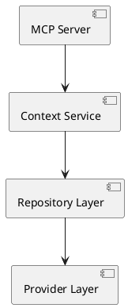

# ADR 005: Automated Documentation System

Date: 2026-01-07

## Status

Accepted

## Context

The MCP Context Browser is a complex enterprise system with multiple components, APIs, and business logic. Manual documentation maintenance is error-prone, time-consuming, and often becomes outdated.

Key requirements:
1. **Accuracy**: Documentation must stay synchronized with code
2. **Completeness**: All public APIs and business logic documented
3. **Accessibility**: Multiple documentation formats for different audiences
4. **Automation**: Documentation generation integrated into CI/CD
5. **Quality**: Professional documentation standards

## Decision

Implement an automated documentation system using existing scripts and tools:

1. **mdBook**: Interactive documentation platform
2. **Cargo modules**: Automated dependency graph generation
3. **ADR System**: Professional decision documentation
4. **API Documentation**: Auto-generated from code comments
5. **CI/CD Integration**: Automated documentation validation and deployment

## Consequences

### Positive
- **Consistency**: Documentation automatically stays current
- **Accuracy**: No drift between code and documentation
- **Efficiency**: Reduced manual documentation effort
- **Quality**: Consistent formatting and structure
- **Accessibility**: Multiple formats and delivery methods

### Negative
- **Tool Complexity**: Multiple documentation tools to maintain
- **CI/CD Overhead**: Documentation generation adds build time
- **Learning Curve**: Understanding documentation tooling

### Risks
- **Tool Failures**: Documentation generation could break builds
- **Over-Automation**: Important context lost in automation
- **Maintenance Burden**: Keeping documentation tools updated

## Implementation

### Documentation Architecture

```
docs/
├── architecture/          # System architecture docs
│   ├── adr/              # Architecture Decision Records
│   ├── diagrams/         # Auto-generated diagrams
│   └── ARCHITECTURE.md   # System overview
├── user-guide/           # User documentation
├── developer/            # Developer guides
├── operations/           # Deployment and operations
├── api/                  # API documentation
└── book.toml            # mdBook configuration
```

### Automation Scripts

#### ADR Management
```bash
# Create new ADR
scripts/docs/create-adr.sh batch "Decision Title"

# Validate ADRs
scripts/docs/validate-adrs.sh
```

#### Documentation Generation
```bash
# Generate all docs
scripts/docs/automation.sh

# Generate module graphs
scripts/docs/generate-module-docs.sh

# Generate mdBook
scripts/docs/generate-mdbook.sh
```

#### Quality Assurance
```bash
# Validate documentation
scripts/docs/validate-structure.sh
scripts/docs/validate-links.sh

# Fix markdown issues
scripts/docs/fix-markdown.sh
```

### CI/CD Integration

#### Documentation Pipeline
```yaml
documentation:
  - scripts/docs/automation.sh
  - scripts/docs/validate-adrs.sh
  - scripts/docs/validate-links.sh
  - scripts/docs/generate-diagrams.sh
```

#### Quality Gates
- ✅ ADR validation passes
- ✅ Link validation passes
- ✅ Markdown linting passes
- ✅ Documentation builds successfully

### Content Automation

#### API Documentation
```rust
/// Business logic description
///
/// # Business Value
/// - Point 1
/// - Point 2
///
/// # Examples
/// ```
/// // Example usage
/// ```
pub struct Component {
    // Implementation
}
```

#### Architecture Diagrams


## Documentation Standards

### Code Documentation
- **Modules**: Business purpose and architecture role
- **Structs**: Business entities and responsibilities
- **Functions**: Business logic and side effects
- **Error Types**: When errors occur and recovery guidance

### ADR Standards
- **Context**: Business problem being solved
- **Decision**: Technical approach chosen
- **Consequences**: Business impact assessment
- **Implementation**: Code examples and integration points

### User Documentation
- **Getting Started**: Quick setup for business users
- **API Reference**: Complete endpoint documentation
- **Troubleshooting**: Common issues and solutions
- **Best Practices**: Enterprise usage patterns

## Tool Selection

### mdBook
- **Pros**: Interactive, searchable, professional appearance
- **Use**: User guides, developer documentation, API references

### Cargo modules
- **Pros**: Automatic dependency visualization
- **Use**: Architecture diagrams, module relationship documentation

### ADR Tools
- **Pros**: Structured decision documentation
- **Use**: Architecture decisions, technical rationale

### Custom Scripts
- **Pros**: Tailored to project needs
- **Use**: Validation, automation, quality assurance

## Quality Assurance

### Automated Checks
- **Markdown Linting**: Consistent formatting
- **Link Validation**: All references working
- **ADR Compliance**: Required fields present
- **Documentation Coverage**: Minimum documentation standards

### Manual Reviews
- **Content Quality**: Business accuracy and clarity
- **Technical Accuracy**: Code examples working
- **Completeness**: All features documented

## References

- [mdBook Documentation](https://rust-lang.github.io/mdBook/)
- [Cargo modules](https://github.com/regexident/cargo-modules)
- [ADR Guidelines](https://adr.github.io/)
- [Documentation Best Practices](https://documentation.divio.com/)