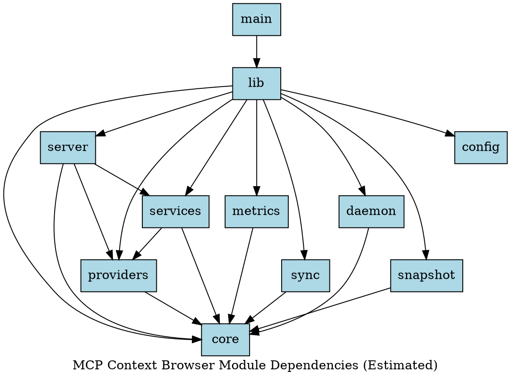

# Module Dependencies

This document shows the internal module dependencies of the MCP Context Browser.

## Dependencies Graph

## Analysis

The dependency graph above shows estimated module relationships within the codebase. Higher-level modules depend on lower-level core modules, creating a clean layered architecture.

Key dependency patterns:
- **Entry point** (main) depends on library (lib)
- **Business logic** (services) depends on providers and core
- **HTTP server** depends on all major components
- **Core modules** have minimal dependencies

*Generated automatically on: 2026-01-07 21:25:37 UTC*
