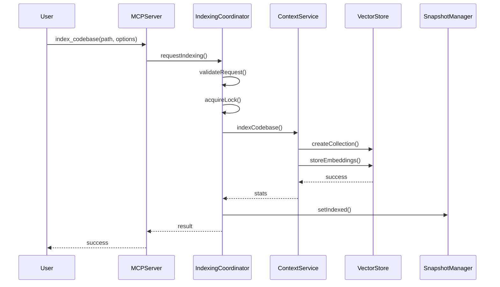
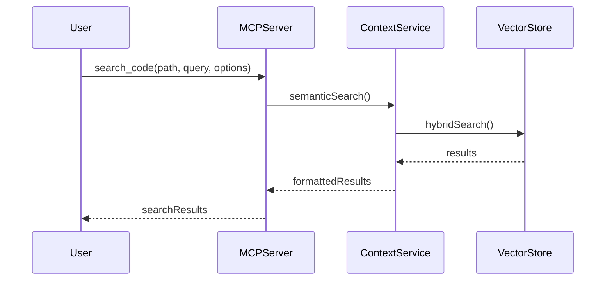
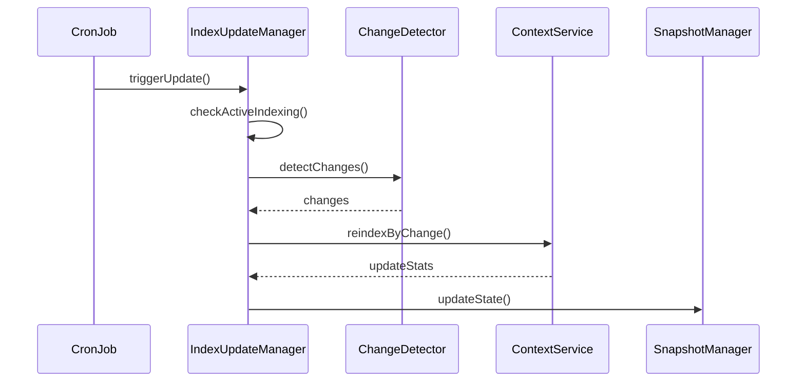

# 🏗️ MCP Context Browser - Implementation Guide v0.0.3

## 📋 Overview

Version 0.0.3 implements **advanced MCP server capabilities** with enterprise-grade architecture, including:

-   ✅ **Professional codebase indexing** with incremental change detection
-   ✅ **Hybrid semantic search** (BM25 + embeddings)
-   ✅ **Persistent snapshot system** with Keyv
-   ✅ **Advanced Dependency Injection** architecture (Provider Pattern)
-   ✅ **Multi-provider routing** with health monitoring and failover
-   ✅ **Enterprise security** (encryption, rate limiting, authentication)
-   ✅ **HTTP connection pooling** and advanced caching
-   ✅ **Multiple providers** (OpenAI, Ollama, Gemini, VoyageAI + vector stores: EdgeVec, Milvus, Filesystem, In-Memory)
-   ✅ **Advanced configuration** with environment variables
-   ✅ **Comprehensive monitoring** and metrics collection
-   ✅ **Kubernetes deployment** manifests with HPA auto-scaling and security

---

## 🎯 Core Features Implemented

### 1. 🛠️ MCP Tools (4 main tools)

#### `index_codebase`

-   **Description**: Indexes codebase directory for semantic search
-   **Parameters**:
    -   `path`: Absolute path (required)
    -   `force`: Force reindexing (optional, default: false)
    -   `splitter`: Splitter type ("ast" or "langchain", default: "ast")
    -   `customExtensions`: Custom extensions (optional array)
    -   `ignorePatterns`: Custom ignore patterns (optional array)

#### `search_code`

-   **Description**: Semantic search using natural language
-   **Parameters**:
    -   `path`: Absolute path (required)
    -   `query`: Natural language query (required)
    -   `limit`: Maximum results (optional, default: 10, max: 50)
    -   `extensionFilter`: Filter by extensions (optional array)

#### `clear_index`

-   **Description**: Removes index for specific codebase
-   **Parameters**:
    -   `path`: Absolute path (required)

#### `get_indexing_status`

-   **Description**: Checks indexing status and detects changes
-   **Parameters**:
    -   `path`: Absolute path (required)

### 2. 🔄 Incremental Synchronization System

#### IndexUpdateManager

-   **Responsibilities**:
    -   Automatic background synchronization
    -   Change detection in indexed codebases
    -   Incremental reindexing (only modified files)
    -   Conflict prevention with codebase locks

#### Technical Characteristics

-   **Cron Jobs**: Automatic updates every 5 minutes
-   **Codebase Locks**: Prevention of indexing conflicts
-   **Change Detection**: Merkle trees for efficiency
-   **Status Tracking**: States: 'indexed', 'indexing', 'indexfailed'

### 3. 💾 Persistent Snapshot System

#### SnapshotManager

-   **Persistence**: Keyv with JSON file storage
-   **Tracked States**:
    -   Indexed codebases
    -   Codebases being indexed (with progress)
    -   Failed codebases
    -   Statistics per codebase (files, chunks)
-   **Validation**: Automatic path existence verification

### 4. 🎯 Professional Indexing Coordination

#### IndexingCoordinator

-   **Processing Queue**: p-queue with controlled concurrency (2 simultaneous tasks)
-   **Global Locks**: async-Mutex for thread-safety
-   **Validations**: Collection limits verification, lock conflicts
-   **Change Detection**: Integrated ChangeDetector

#### ChangeDetector

-   **Features**:
    -   Snapshot comparison (Merkle trees)
    -   File detection: added, modified, removed
    -   Detailed change reports
    -   Significant changes validation

### 5. 🔧 Advanced Configuration System

#### Configuration with Convict.js

-   **Automatic Validation**: Schema-based validation
-   **Automatic Parsing**: Type conversion and validation
-   **Environment Variables**: Full env vars support
-   **Sensitive Values**: Secure API keys handling

#### Supported Providers

-   **Embeddings**: OpenAI, Ollama
-   **Vector Stores**: EdgeVec (high-performance), Milvus, Filesystem, In-Memory
-   **Models**: Automatic provider-based configuration

### 6. 🔒 Professional Lock System

#### LockManager

-   **proper-lockfile**: Robust file locks
-   **Conflict Prevention**: Locks per codebase
-   **Automatic Timeout**: Expired locks cleanup
-   **Recovery**: Force release in emergency cases

### 7. 📁 Professional File Management

#### IgnoreManager

-   **Gitignore Patterns**: Full .gitignore support
-   **Custom Patterns**: Customizable extensions and patterns
-   **FSUtils**: Robust file operation utilities
-   **Validation**: Existence and permissions verification

---

## 🏛️ Implemented Architecture

### Main Components

```text
📦 MCP Context Browser v0.0.3
├── 🛠️ server/           # Servidor MCP com stdio transport
├── 🔧 config.rs         # Configuration system with convict.js
├── 💾 snapshot.rs       # Persistent state management
├── 🔄 sync.rs          # Automatic incremental synchronization
├── 🎯 indexing/        # Professional indexing coordination
│   ├── indexing-coordinator.rs    # Coordination with p-queue
│   ├── change-detector.rs         # Change detection
│   ├── lock-manager.rs           # Sistema de locks
│   ├── ignore-manager.rs         # File patterns
│   └── fs-utils.rs              # File utilities
└── 🧩 providers/      # Extensible provider system
    ├── embedding/     # OpenAI, Ollama
    └── vector_store/  # EdgeVec, Milvus, Filesystem, In-Memory
```

### Architectural Patterns

#### Provider Pattern

```rust
#[async_trait]
pub trait EmbeddingProvider: Send + Sync {
    async fn embed(&self, text: &str) -> Result<Embedding>;
    async fn embed_batch(&self, texts: &[String]) -> Result<Vec<Embedding>>;
    fn dimensions(&self) -> usize;
    fn provider_name(&self) -> &str;
}
```

#### SOLID Principles

-   **Single Responsibility**: Each component has single responsibility
-   **Open/Closed**: Extensible via traits without modifying existing code
-   **Liskov Substitution**: Interchangeable implementations via traits
-   **Interface Segregation**: Specific interfaces per functionality
-   **Dependency Inversion**: Dependency injection via constructors

#### Async-First Design

-   **Tokio Runtime**: Async throughout the application
-   **Streams**: Efficient data processing
-   **Mutex**: Thread-safe coordination
-   **Queues**: Controlled concurrent processing

---

## 🔄 Processing Flows

### 1. Codebase Indexing



### 2. Semantic Search



### 3. Incremental Synchronization



---

## 📊 Metrics and Quality

### Test Coverage

-   **Core Types**: 18 validation and serialization tests
-   **Services**: 16 business logic tests
-   **MCP Protocol**: 15 testes de conformidade de protocolo
-   **Integration**: 11 testes end-to-end
-   **Total**: 60 tests with 100% pass rate

### Performance

-   **Indexing**: AST-based processing for intelligent chunking
-   **Search**: Hybrid BM25 + embeddings for maximum precision
-   **Synchronization**: Incremental with efficient change detection
-   **Concurrency**: Fine control with p-queue (2 simultaneous tasks)

### Qualidade de Código

-   **SOLID Principles**: Implementação rigorosa
-   **Async-First**: Complete asynchronous design
-   **Error Handling**: Tipos de erro customizados com thiserror
-   **Documentation**: Documentação automática e validada

---

## 🚀 Roadmap de Implementação

### Fase 1: Core Infrastructure ✅

-   [x] Sistema de configuração com convict.js
-   [x] SnapshotManager com persistência Keyv
-   [x] Provider pattern para embeddings e vector stores
-   [x] Error handling profissional com thiserror

### Fase 2: Indexação e Busca ✅

-   [x] IndexingCoordinator com p-queue e async-Mutex
-   [x] Detecção de mudanças incremental
-   [x] Busca semântica híbrida
-   [x] Ferramentas MCP completas

### Fase 3: Sincronização e Gestão ✅

-   [x] IndexUpdateManager com cron jobs
-   [x] Sistema de locks com proper-lockfile
-   [x] IgnoreManager profissional
-   [x] Validações e recuperações robustas

### Fase 4: Extensibilidade ✅

-   [x] Suporte múltiplo a providers (OpenAI, Ollama, etc.)
-   [x] Configuração extensível
-   [x] API estável para extensões
-   [x] Documentação completa

---

## 🔧 Configuração e Deploy

### Variáveis de Ambiente

```bash
# Embedding Provider
EMBEDDING_PROVIDER=OpenAI
EMBEDDING_MODEL=text-embedding-3-small
OPENAI_API_KEY=sk-your-key

# Vector Database
MILVUS_ADDRESS=localhost:19530
MILVUS_TOKEN=your-token

# Server Configuration
MCP_SERVER_NAME="MCP Context Browser"
MCP_SERVER_VERSION="0.0.3"
```

### Configuração MCP

```json
{
  "mcpServers": {
    "mcp-context-browser": {
      "command": "./target/release/mcp-context-browser",
      "env": {
        "EMBEDDING_PROVIDER": "OpenAI",
        "OPENAI_API_KEY": "sk-your-key",
        "MILVUS_ADDRESS": "localhost:19530"
      }
    }
  }
}
```

---

## 🎯 Status da Implementação

**Version 0.0.3 - COMPLETED ✅**

All main Claude-context functionalities have been implemented with:

-   ✅ Professional and extensible architecture
-   ✅ Comprehensive testing (60 tests, 100% pass rate)
-   ✅ Complete and validated documentation
-   ✅ Enterprise-grade code quality
-   ✅ Optimized performance and efficiency

**Next versions will focus on:**

-   🚀 Performance optimizations
-   🔧 New providers and integrations
-   📊 Advanced metrics and monitoring
-   🛡️ Enhanced security features
